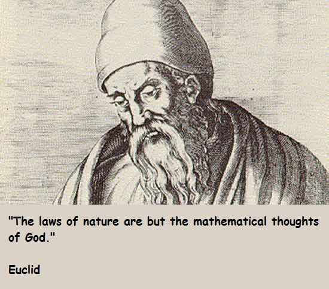

## Problem Solving Session 1 - C++ Basics

Hong Kong - 23 Feb 2021

## Problem 1

A right triangle has the sides `s1`, `s2` and a hypotenuse `h`. The three numbers must satify that the condition that `s1 * s1 + s2 * s2 = h * h`. When these three numbers are integers, we call them a **Pythagorean triple**. An example is the set of three integers `3`, `4` and `5`.

Write a program to find all Pythagorean triples for `s1`, `s2`, and `h` all no greater than `300`. Use a “brute-force” technique, meaning that your program simply uses a triple-nested for loop that tries all possibilities.

### Solution 1

A straightforward answer would be

```cpp
// ENGG1340 / COMP2113, Problem Solving Session
// Problem Solving Session 1 - C++ Basics

// Problem 1 - Solution 1

#include <iostream>
using namespace std;

int main() {
  int s1, s2, h;  // the three sides of a triangle

  int N = 300;

  // loop through s1, s2, h and check if
  // they satisfy the condition s1^2 + s2^2 = h^2
  for (s1 = 1; s1 <= N; ++s1)
    for (s2 = 1; s2 <= N; ++s2)
      for (h = 1; h <= N; ++h) {
        if (s1*s1 + s2*s2 == h*h)
          cout << s1 << " " << s2 << " " << h << endl;
      }

  return 0;
}
```
Time complexity: <code>O(n<sup>3</sup>)</code>

### Solution 2

We don't need `(4, 3, 5)` when we have `(3, 4, 5)`. `s1, s2 < h` is obvious. Also [without loss of generality](https://en.wikipedia.org/wiki/Without_loss_of_generality), we can assume `s1 < s2 < h`:

```cpp
// ENGG1340 / COMP2113, Problem Solving Session
// Problem Solving Session 1 - C++ Basics

// Problem 1 - Solution 2

#include <iostream>
using namespace std;

int main() {
  int s1, s2, h;  // the three sides of a triangle

  int N = 300;

  // loop through s1, s2, h and check if
  // they satisfy the condition s1^2 + s2^2 = h^2
  for (s1 = 1; s1 <= N - 2; ++s1)
    for (s2 = s1 + 1; s2 <= N - 1; ++s2)
      for (h = s2 + 1; h <= N; ++h) {
        if (s1*s1 + s2*s2 == h*h)
          cout << s1 << " " << s2 << " " << h << endl;
      }

  return 0;
}
```
Time complexity: <code>O(n<sup>3</sup>)</code>

### Solution 3

When we have `s1` and `s2`, it makes no sense to traverse from `s2 + 1` to `N` for `h`. The essence of the problem is that `h` needs to be an integer. That is to say `s1^2 + s2^2` needs to be a square number. A square number's square root is an integer:

```cpp
// ENGG1340 / COMP2113, Problem Solving Session
// Problem Solving Session 1 - C++ Basics

// Problem 1 - Solution 3

#include <iostream>
#include <cmath>
using namespace std;

int main() {
  int s1, s2, h;  // the three sides of a triangle

  int N = 300;

  // loop through s1, s2, h and check if
  // they satisfy the condition s1^2 + s2^2 = h^2
  for (s1 = 1; s1 <= N - 1; ++s1)
    for (s2 = s1 + 1; s2 <= N; ++s2) {
      if (s1*s1 + s2*s2 > N*N)
        break;
      double h = sqrt(s1*s1 + s2*s2);
      double h_int;
      if (modf(h, &h_int) == 0.0)
        cout << s1 << " " << s2 << " " << (int)h << endl;
    }

  return 0;
}
```
Time complexity: <code>O(n<sup>2</sup>)</code>

### Solution 4

For even better performance, we use [Euclid's Formula](https://en.wikipedia.org/wiki/Pythagorean_triple#Generating_a_triple):

```cpp
// ENGG1340 / COMP2113, Problem Solving Session
// Problem Solving Session 1 - C++ Basics

// Problem 1 - Solution 4

#include <iostream>
#include <cmath>
using namespace std;

int gcd(int a, int b) {
  if (b == 0)
    return a;
  return gcd(b, a%b);
}

int main() {
  int s1, s2, h = 0;

  int N = 300;
  // loop from 2 to even half the m^2 (for odd m) is bigger than N 
  int m = 2, n = 1;

  while (m * m + n * n <= 2 * N) {
    // now loop on n from 1 to m-1 (m > n > 0)
      for (; n < m; ++n) {
        if (gcd(m, n) != 1)
          continue;
        // Evaluate and print triplets using
        // the relation between s1, s2 and h
        s1 = m * m - n * n;
        s2 = 2 * m * n;
        h = m * m + n * n;
        if (m * n % 2 == 1) {
          s1 /= 2;
          s2 /= 2;
          h /= 2;
        }
        if (h / 2 > N)
          break;
        // from primitive pythagorean triple to non-primitive
        for (int k = 1; k * h <= N; ++k)
          cout << k*s1 << " " << k*s2 << " " << k*h << endl; 
      }
      n = (int)ceil((float)(++m)/(1.0+sqrt(2.0))); // make sure s1 < s2
    }
    return 0;
}
```
The first two loops each goes through `O(sqrt(n))` values. Finding GCD is in worst case `O(logm) = O(logn)`. The 3rd loop goes through `N / h = O(sqrt(n))` values. 

Time complexity: <code>O(sqrt(n)<sup>2</sup>) * max{O(logn), O(sqrt(n))} = O(n<sup>1.5</sup>)</code>

This algorithm's output has different order from those of previous algorithms.

To achieve the same order, simply use vector to store the values and sort them:

```cpp
// ENGG1340 / COMP2113, Problem Solving Session
// Problem Solving Session 1 - C++ Basics

// Problem 1 - Solution 4

#include <iostream>
#include <cmath>
#include <list>
#include <vector>
using namespace std;

int gcd(int a, int b) {
  if (b == 0)
    return a;
  return gcd(b, a%b);
}

int main() {
  int s1, s2, h = 0;

  int N = 300;
  // loop from 2 to even half the m^2 (for odd m) is bigger than N 
  int m = 2, n = 1;

  list<vector<int>> l;

  while (m * m + n * n <= 2 * N) {
    // now loop on j from 1 to i-1
      for (; n < m; ++n) { 
        if (gcd(m, n) != 1)
          continue;
        // Evaluate and print triplets using
        // the relation between s1, s2 and h
        s1 = m * m - n * n;
        s2 = 2 * m * n;
        h = m * m + n * n;
        if (m * n % 2 == 1) {
          s1 /= 2;
          s2 /= 2;
          h /= 2;
        }
        if (h / 2 > N)
          break;
        // from primitive pythagorean triple to non-primitive
        for (int k = 1; k * h <= N; ++k)
          l.push_back({k*s1, k*s2, k*h});
      }
      n = (int)ceil((float)(++m)/(1.0+sqrt(2.0))); // make sure s1 < s2
    }

    l.sort();
    for (auto &v : l) {
      for (int i = 0; i < 3; ++i) {
        cout << v[i];
        if (i < 2)
          cout << " ";
        else
          cout << endl;
      }
    }
    return 0;
}

```
The time complexity of this algorithm depends on the slower part between finding and sorting answers. 

According to [Manuel Benito and Juan L. Varona](https://www.unirioja.es/cu/jvarona/downloads/Benito-Varona-JCAM-Publicado.pdf), There are `O(nlogn)` Pythagorean triangles with legs less than `n`. 

Time complexity:

<pre><code>  max{O(n<sup>1.5</sup>), O(nlogn * log(nlogn))} 
= max{O(n<sup>1.5</sup>), O(nlogn * (logn + log(logn)))}
= max{O(n<sup>1.5</sup>), O(nlog<sup>2</sup>n)}
= O(n<sup>1.5</sup>)
</code></pre>

To scale up the algorithm, you could replace `int` with `long long`, or even `uint128_t`, and `float` woth `long double`.

What's interesting is that we also used [Euclid's Algorithm](https://en.wikipedia.org/wiki/Greatest_common_divisor#Euclid's_algorithm) for calculating GCD ([Greatest Common Divisor](https://en.wikipedia.org/wiki/Greatest_common_divisor) not [Gong Chan Dang](https://en.wikipedia.org/?title=Gongchandang&redirect=no)).

All hail Euclid!



## Problem 2

Write a program that accepts from user input a year written as a 4-digit number and outputs the Roman number equivalent (e.g., `MMXXI`). You may assume that the year is within the range `[1000, 2999]`.

The symbols used in the Roman numerals are:

|Symbol | I | V |  X |  L |   C |   D |    M |
|:------|--:|--:|---:|---:|----:|----:|-----:|
|Value  | 1 | 5 | 10 | 50 | 100 | 500 | 1000 |

For example, the Roman number equivalent of the year `2021` is `MMXXI` (`= MM + XX + I`).

Note that the numbers `4` and `9` are represented using subtraction: `4` = `IV` (one less than five), `9` = `IX` (one less than ten), and the same is for the numbers `40`, `90`, `400` and `900`.

More examples:
- `1954 = M + CM + L + IV = MCMLIV`
- `1009 = M + IX = MIX`

Also see similar [LeetCode Problem](https://leetcode.com/problems/integer-to-roman/).

## Problem 3

Modify the program in [Problem 2](#problem-2) above, so that it accepts user inputs repeatedly and outputs the Roman number equivlants, until the user inputs `0` and the program will terminate.
