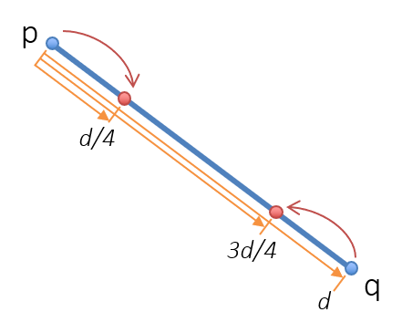
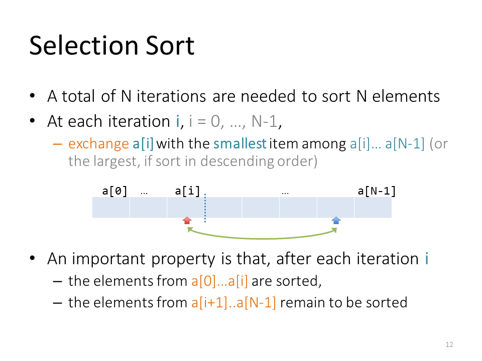

## Problem Solving Session 4 - Structs & Recursion

Hong Kong - 30 Mar 2021

## Problem 1 - Structs
(**Programming Problem 1** on page *21* from *Guidance Notes 7.2* and sample code from pages *19-20*)
```cpp
#include <iostream>
#include <string>
#include <cmath>
using namespace std;

// 2D point
struct Point {
    double x;
    double y;
};

// distance between two points p and q
double point_distance(Point p, Point q) {
    double dx = p.x - q.x;
    double dy = p.y - q.y;
    return sqrt(dx * dx + dy * dy);
}

// get a point from user input
Point input_point() {
    double x, y;
    cin >> x >> y;
    Point p = {x, y};
    return p;
}

// swap two points p and q
void swap(Point &p, Point &q) {
    Point temp = p;
    p = q;
    q = temp;
}

int main() {
    cout << "Input 1st point (x,y): ";
    Point a = input_point();

    cout << "Input 2nd point (x,y): ";
    Point b = input_point();

    cout << "Distance between point: " << point_distance(a, b) << endl;

    swap(a, b);
    cout << "1st point: " << a.x << ' ' << a.y << endl;
    cout << "2nd point: " << b.x << ' ' << b.y << endl;

    return 0;
}
```

- Add a function named `midpoint()` in `spoint.cpp`, which returns the mid-point of two 2D points.
```cpp
// mid-point of two points p and q
Point midpoint(Point p, Point q);
```
- Add a function named `shrink_line()` in `spoint.cpp`, which shrink a line defined by two endpoints as follows:
```cpp
// shrink a line with endpoints p and q
void shrink_line(Point &p, Point &q);
```


## Problem 2 - Recursion
Write a recursive function to sort an array of integers into ascending order using the following idea: 

Place the smallest element in the first position, then sort the rest of the array by a recursive call. This is a recursive version of the selection sort algorithm we discussed in Module 6.1. (Question taken from the reference book: *Problem Solving with C++*)

The following slide reviews what how selection sort works: 


